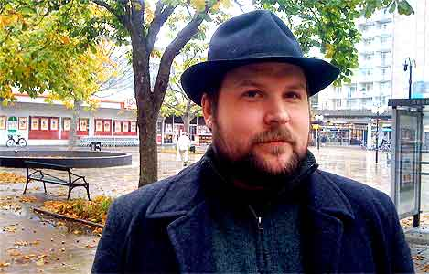

*Markus Persson, owner of an independent game development studio, dedicated the 
resources of his entire company towards a charity drive. Photo by: Foto: Joel 
Dahlberg, <http://www.e24.se>*

# Game Developers Raise Almost $500,000 for Charity

**By: [Julian Møller](mailto:julian@julianmoeller.dk)**

Markus Persson, known as Notch, is thecreator of the wildly popular game called 
Minecraft. This weekend he set up a 60-hour drive for charity. Being inspired 
by competitions, in which contestants producea computer game in a just a 
weekend, his company Mojang set up their own so called "jam" over the weekend. 
The theme of the game the company should create was chosen by people on the 
internet via polls on Mojang's website. The most and least popular options were 
combined, which resulted in a game that should be an obscure mix between the 
Real Time Strategy and Shoot 'Em Up genres. Thegame should be set in a 
Steampunky Ancient Egypt.

The game jam got set up with help from the people behind the numerous so-called 
Humble Bundles. The Humble Bundles are collections of different games, that can 
be bought for whatever amount people feel like. The buyers can even decide, who 
their money should go to: the game developers, charity organizations, the 
people organizing the bundle or a combination of the three. These bundles have 
in the past been very popular, raising many million dollars both for a lot of 
indiegame developers and charities.

This weekend, there were only one option, though: Charity. The money raised 
during the jam all went to the american Red Cross, Child's Play, the Electronic 
Frontier Foundation and charity:water. During friday night, two more game 
studios joined the action and also vowed to create games for charity: Wolfire 
Games (the game developers behind the Humble Bundles) and Oxeye Game Studio.

When Sunday had passed, the three companies had manage to raise $458,214.95 by 
selling 81,573 gamebundles. So in the end, Markus Persson got to keep his 
beard, which he had promised to shave, had the bundle raised $500,000.