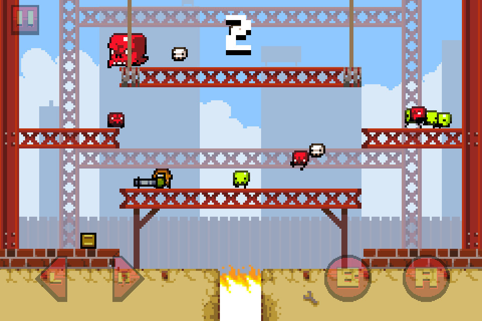
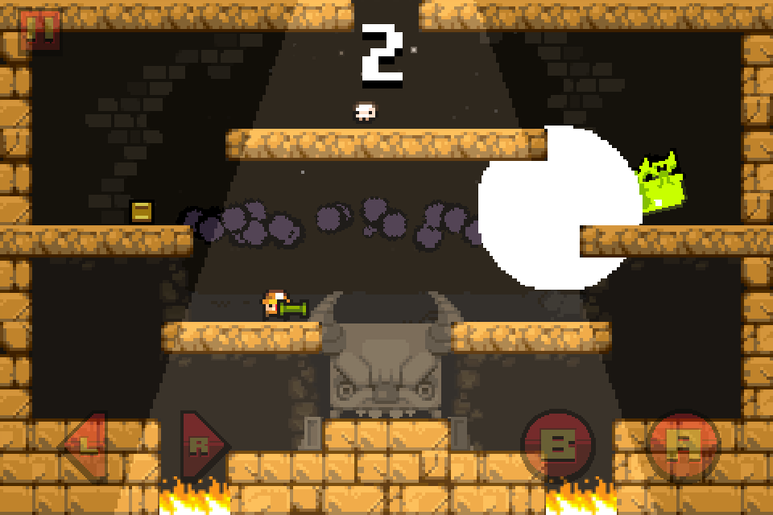
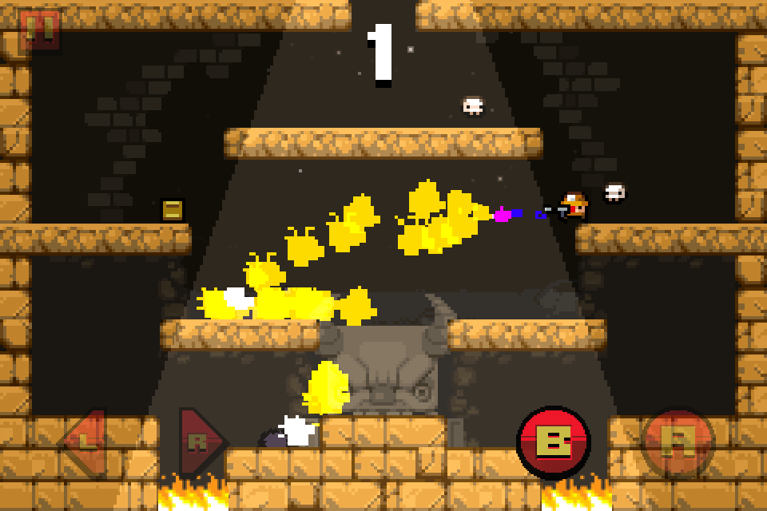
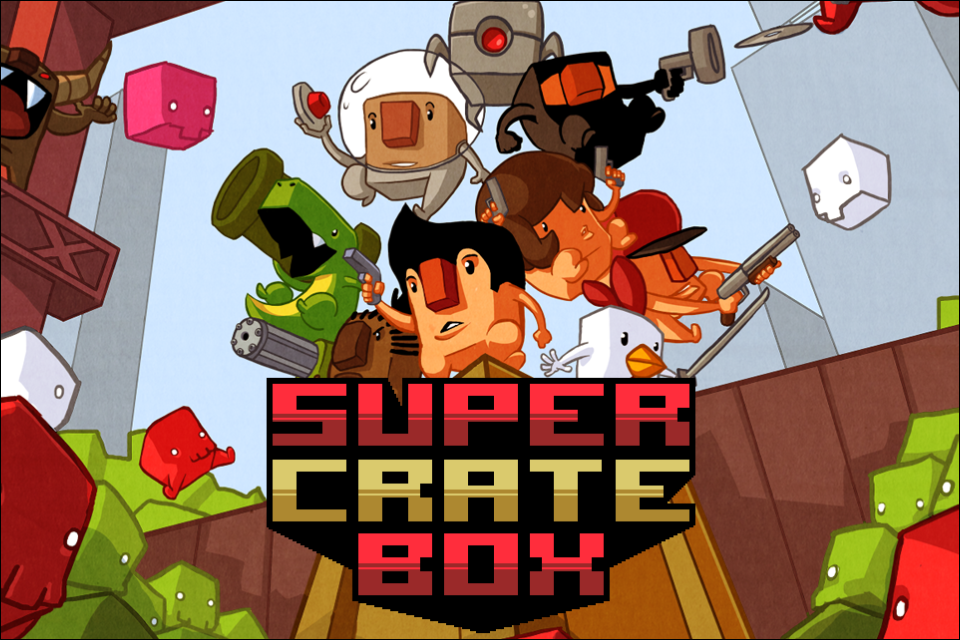

Review: Super Crate Box
=========================

**By [Julian Møller](mailto:julian@julianmoeller.dk)**

  
_The premise is simple: Run, jump, shoot, avoid monsters, kill monsters, 
collect crates. It's the ingenuity in the way that the basic elements have been 
put together, make Super Crate Box shine. Out for iPhone and iPod Touch, for 
$1, it's an addictive gem that should not to be missed._

---

Super Crate Box is actually a very simple game. It has retro-like graphics, a 
four-button control scheme, one-screen levels and unintelligent enemies. It 
looks, sounds and feels like a classic arcade game. And it's all about beating 
the high score.

It's a casual experience that you can pick up when you have a spare minute, but 
it has hardcore elements as well. You die easily, but it's easy and fast to 
start again.

Instead of getting points by how long you survive or how many monsters you've 
killed, you get points for how many crates containing weapons you pick up. When 
you pick up a crate, your old weapon is replaced with a new one. Because the 
crates spawn at random positions, you are forced to keep moving around the 
level, and you never get to keep your favorite weapon for long.

  
_The rocket launcher kills everything within its blast radius, but travels and 
reloads a bit slow._

The three different levels all have a hole in the ceiling and one or more fiery 
pits on the bottom. Monsters emerge from the top and waddle either left or 
right, turning around when they hit walls. This way, they make their way 
downwards. If the monsters fall into the fire, they don't die: They just get 
angry and respawn at the top in a faster and redder edition. The type and 
amount of monsters that spawn at a given time is random. The three levels are 
quite similar, but their different layout makes the pacing and the viable 
strategies a lot different.

The game has a vast arsenal of weapons, ranging from a devastating bazooka over 
a almost melee katana and ending with the unforgiving disc-gun and the 
difficult to time mines. The weapons have very different use cases and potency, 
which makes sure that the gameplay becomes varied. Somehow the game knows that 
whatever weapon you just picked up is your least favorite, so it punishes you 
with sending huge waves down from the ceiling. Or so it seems. The game is full 
of moments that make you go _Oh sh**!_, all based on the randomness of the 
weapons and monster spawns. The game is unforgiving and hard, but never unfair.

  
_The flame thrower is one of the more tricky weapons, as monsters need to walk 
through the fire for a while before they die._

Super Crate Box is structured in a way that makes you keep playing. In the 
beginning you only have a single weapon, but slowly, more and more weapons are 
unlocked, as you collect more and more crates. You also unlock later levels, 
when you have proved your proficiency in the previous ones. And then, you can 
unlock the harder versions of the levels, making the challenge even greater. 
The game also rewards you with vanity unlocks in the form new playable 
characters. A number of are characters from indie games, such as Super Meat Boy 
and Canabalt.

When you first start playing the game, you die. A lot. But then, slowly, you 
start to die later and later. You learn the rules of the game. You get better. 
You develop strategies, you learn when to retreat, when to stand your ground 
and clean up, and when to press on towards the next crate. You actually get 
_better_ at the game, even though it has many random elements, and that feels 
great.

Super Crate Box' single problem is, that the control scheme becomes a bit 
awkward once you try to get _high_ scores in the difficult versions of the 
level. Here, there can be so many monsters, that the game requires three 
fingers to control: One for left/right, and two for jump/shoot, so it can be 
done simultaneously.

The only meaningful score I can give a cheap game like Super Crate Box is 
whether or not to buy it. In this case, the verdict is **Buy!!**. The game can 
easily entertain you for many weeks, until you have unlocked everything and 
raked in all the achievements. After that, it might be shelved, because new 
content doesn't seem to be coming. But -- for $1 (6 DKK), this game is a well 
worth the money and delivers far more value than its price.

  
_The title screen for Super Crate Box, showing a lot of the different characters._